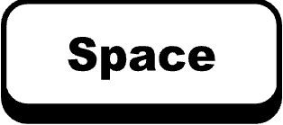

# Description 

"Zombie Surrounding" is my first OOP game which I learn from Ironhack Bootcamp. It is built with web technologies such as html, css and javascript. 

In this game, you can move the player, change direction and shoot the zombie. I add some amazing sound effect and background music, please turn on your speaker. 

You can see the score in the game and gameover page. Can you get the ranking of **"Zombie Master?"**. Let's try!
 
 

 

 

 
 

# How to play

You can control the player move horizontally and vertically by 4 keys:

W A S D

 
 

Turn directions by arrow keys:

&uarr;
&darr;
&larr;
&rarr;

 

Shoot by space bar. The gun is so powerful and bullets can pass through the zombies. Besides, you have unlimited bullets.
 
 

 

The zombies will appear from different position of the edge. And they will be faster if they are close to the player. By the time pass, there will be more zombies in the screen as they are attracted by your shoot. However, no pain no gain, you will also get more scores.

Be carful, don't let a zombie "touch" the player, or Gameover.

 

# Demo
https://xavier-chang.github.io/zombie-game/

 

# Further Improvements

Functionality:
- Leaderboard
- Change weapons
- Bullet disappear after hitting zombie
- Reload the bullets
- Multiple lives
- Add zombie boss
- Score based on the type of zombie 

UX:
- Set the volume level in start page
- Random backgorund
- When the player die, the screen becomes darker 

Code quality:
- Avoid repeating code for zombie class
- Simplify if statements.
